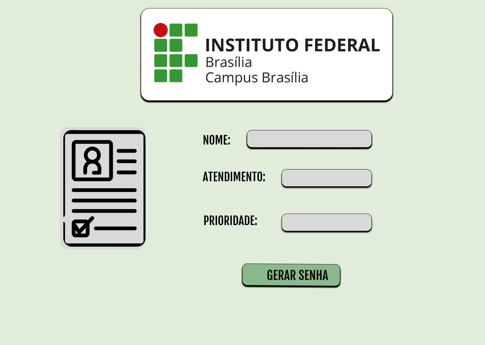
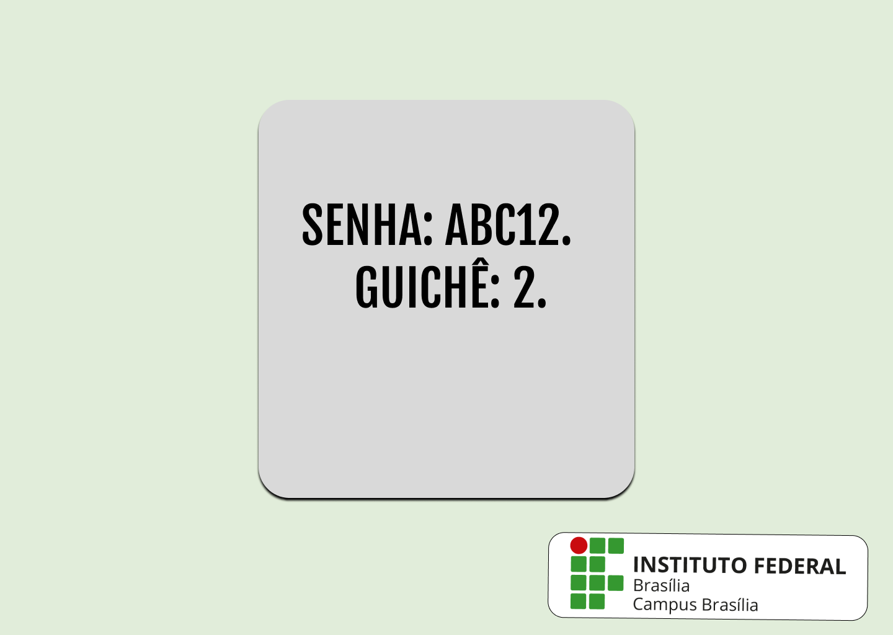

# 👾 PROTÓTIPO SISTEMA DE GERENCIAMENTO DE SENHAS
Documento que contém informações acerca do projeto em desenvolvimento para o registro acadêmico do Instituto Federal de Brasília, que consta em realizar um sistema para gerenciar o atendimento do setor. 

## 🔍 Índice

- Funcionalidades do Projeto.
- Layout.
- Tecnologias Utilizadas.
- Autores.

## 🔧Funcionalidades do Projeto

-[x] Registro de usuário.

-[x] Identificação de prioridade do usuário caso haja.

-[x] Gerenciamento de atendimento. 

-[x] Convocação de pessoas prioritárias.

-[x] Organização da seção local do registro acadêmico do Instituto Federal de Brasília.  

## ✍️Layout

## 🖥️ Tecnologias utilizadas
1. HTML5
2. CSS3
3. [Figma](https://www.figma.com/)
4. [Sublime](https://www.sublimetext.com/)
5. JavaScript

## 🖊️ Autores
1. <a href="https://github.com/Jalys0n">José Alyson</a>
2. <a href="https://github.com/Kijimoshi-sama">Igor de Oliveira</a> 
3. <a href="https://github.com/Zekks12">Davi Leal</a> 
4. <a href="https://github.com/cleorbeth">Cleorbeth Santos</a>
